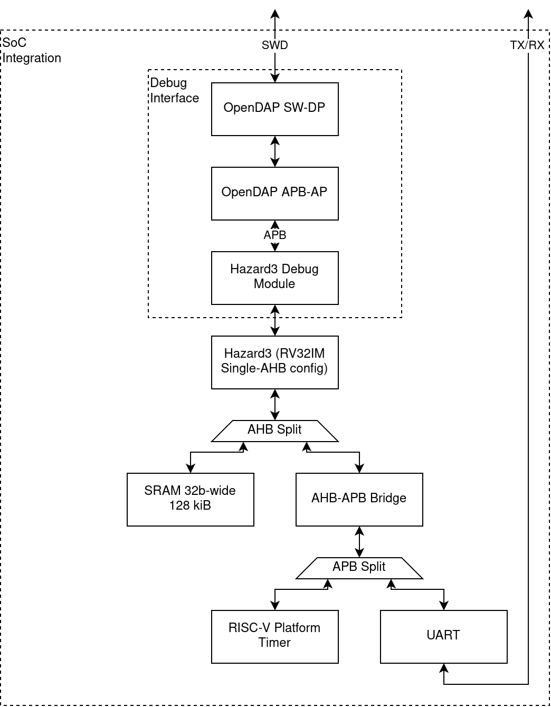

# Example Hazard3 SWD SoC

This repository contains an example integration of my [Hazard3](https://github.com/Wren6991/Hazard3/) RISC-V core (and associated Debug Module) with my [OpenDAP](https://github.com/Wren6991/OpenDAP/) SW-DP and Mem-AP.



This hardware should in theory support RISC-V debug over SWD, in a way that is compliant with the RISC-V debug spec (0.13.2) and the ADI spec (v5.2).

In practice the software situation needs some work, so I put together this simple testbench to give me a real SoC to take a good swing at.

## Building

You will need a recent `yosys` and `nextpnr-ecp5`.

```bash
git clone --recursive https://github.com/Wren6991/Hazard3-SWD-SoC.git hazard3-swd-soc
cd hazard3-swd-soc
. sourceme
cd synth
make
```

Should create a bitstream for a ULX3S development board with an ECP5-85k FPGA

## What did I just build

A tiny SoC with:

- A SW-DP (SWD Debug Port) from [OpenDAP](https://github.com/Wren6991/OpenDAP/)
- A APB-AB (APB Memory Access Port) from [OpenDAP](https://github.com/Wren6991/OpenDAP/)
- A RISC-V Debug Module from [Hazard3](https://github.com/Wren6991/Hazard3/)
- A Hazard3 RISC-V core from [Hazard3](https://github.com/Wren6991/Hazard3/)
- Some SRAM
- A UART
- A RISC-V platform timer

## How do I program it

No idea, good luck, have fun
